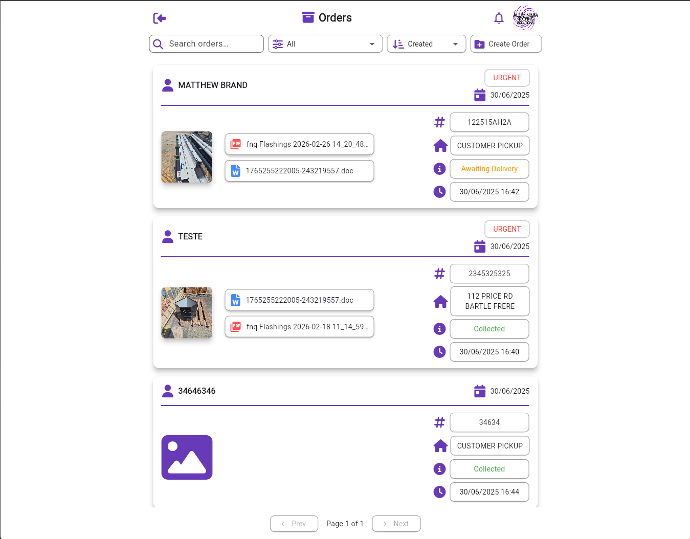
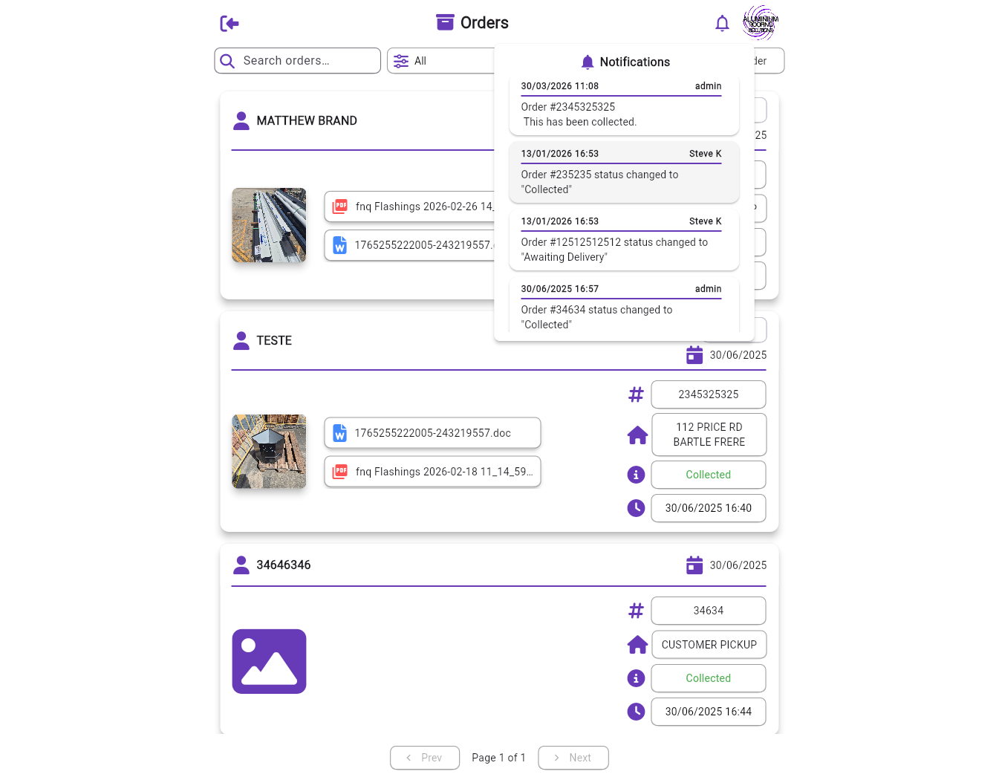
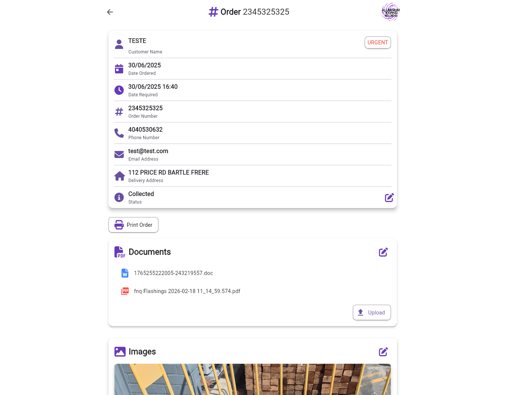
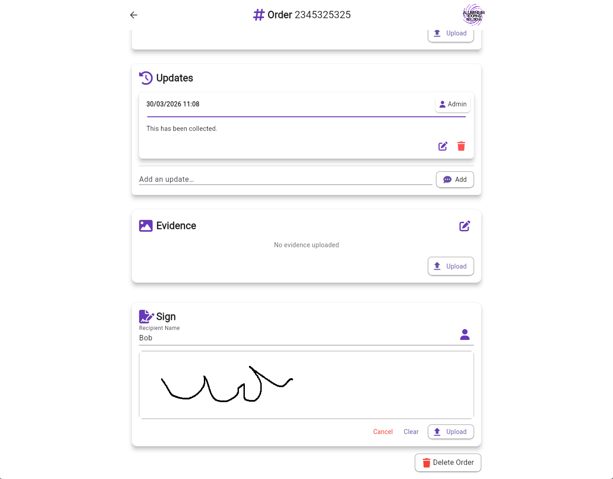

ARS Orders System

A full-stack ordering system built to manage and track customer orders in a real business environment.

🚀 Overview

This project was developed to replace manual and inconsistent ordering processes with a structured, reliable system. It was used in a production environment to handle real customer orders, improving workflow efficiency and reducing errors.

The system includes a web interface, mobile support, and a backend API connected to a database.

🧩 Features
Create and manage customer orders
Search and filter orders by name, ID, or customer
Real-time order status updates
Upload and store images/files with orders
Capture delivery signatures
Generate and manage large volumes of order data
Mobile-friendly responsive design
🛠️ Tech Stack

Frontend

Flutter (Web + Mobile)

Backend

Node.js
Express.js

Database

MySQL

Infrastructure

VPS hosting (DigitalOcean)
REST API architecture

## 📸 Screenshots

### Login

### Orders Page

### Orders Page (Notifications)

### Order Details

### Order Details (More)

🔒 Note on Access

This system is currently running in a live production environment.

Access to the live system is restricted as it contains real business data. Screenshots are provided to demonstrate functionality.

🧠 What I Learned
Designing and building a full-stack system from scratch
Managing real-world data and user workflows
Handling performance with large datasets
Dealing with cross-platform UI challenges
Deploying and maintaining a live application
📌 Future Improvements
Refactor code structure for scalability and maintainability
Improve UI consistency and user experience
Add authentication/role-based access control
Implement better logging and error handling
🔗 Author

Matthew Brand
GitHub: https://github.com/matthewbrand9898
